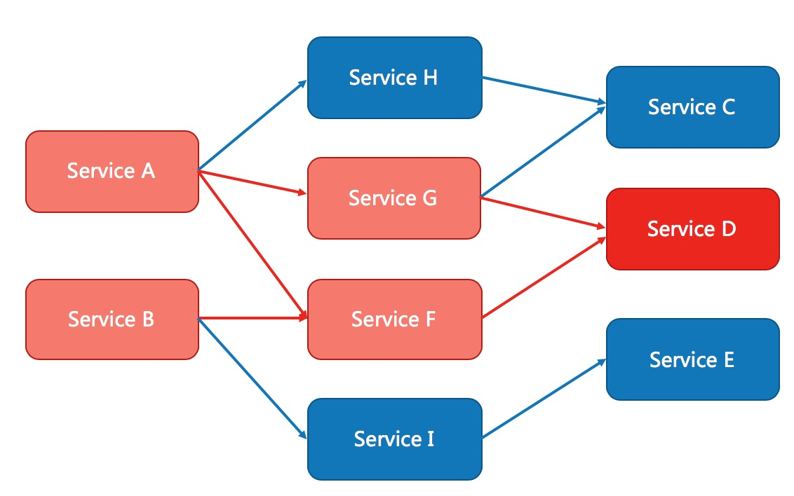
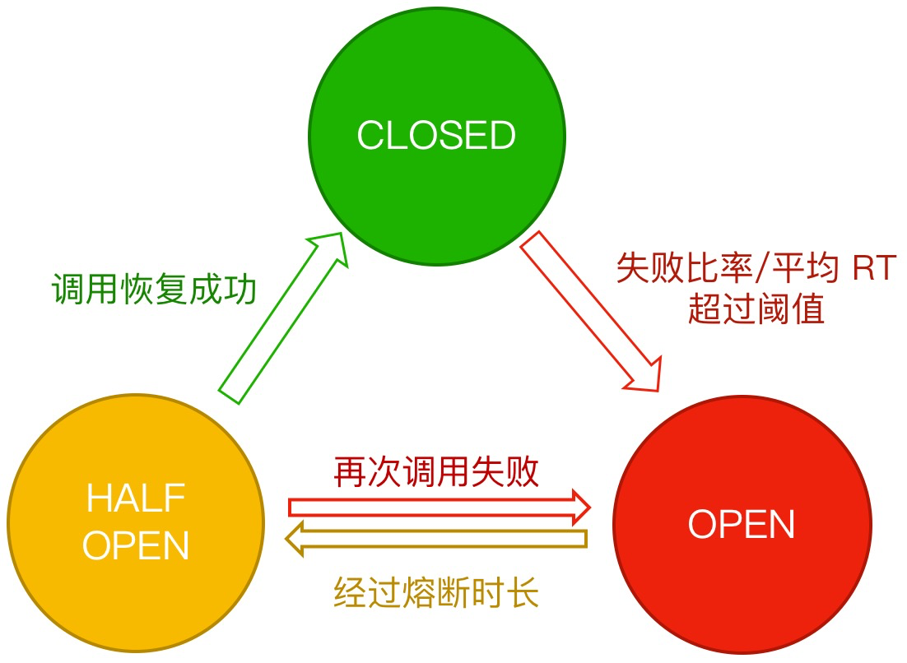

# 背景
```
from : https://sentinelguard.io/zh-cn/docs/golang/circuit-breaking.html
```

在高可用设计中，除了流控外，对分布式系统调用链路中不稳定的资源(比如RPC服务等)进行熔断降级也是保障高可用的重要措施之一。
现在的分布式架构中一个服务常常会调用第三方服务，这个第三方服务可能是另外的一个RPC接口、数据库，或者第三方 API 等等。
例如，支付的时候，可能需要远程调用银联提供的 API；
查询某个商品的价格，可能需要进行数据库查询。然而，除了自身服务外，依赖的外部服务的稳定性是不能绝对保证的。如果依赖的第三方服务出现了不稳定的情况，比如请求的响应时间变长，那么服务自身调用第三方服务的响应时间也会响应变长，也就是级联效应，服务自身的线程可能会产生堆积，最终可能耗尽业务自身的线程池，最终服务本身也变得不可用。下图是一个很抽象且经典的分布式架构中的服务分布图：



现代微服务架构基本都是分布式的，整个分布式系统由非常多的微服务组成。不同服务之间相互调用，组成复杂的调用链路。前面描述的问题在分布式链路调用中会产生放大的效果。整个复杂链路中的某一环如果不稳定，就可能会层层级联，最终可能导致整个链路全部挂掉。因此我们需要对不稳定的 弱依赖服务调用 进行 熔断降级，暂时切断不稳定的服务调用，避免局部不稳定因素导致整个分布式系统的雪崩。熔断降级作为保护服务自身的手段，通常在客户端（调用端）进行配置。

# 熔断器模型
___



熔断器有三种状态：
- Closed 状态：也是初始状态，该状态下，熔断器会保持闭合，对资源的访问直接通过熔断器的检查。
- Open 状态：断开状态，熔断器处于开启状态，对资源的访问会被切断。
- Half-Open 状态：半开状态，该状态下除了探测流量，其余对资源的访问也会被切断。探测流量指熔断器处于半开状态时，会周期性的允许一定数目的探测请求通过，如果探测请求能够正常的返回，代表探测成功，此时熔断器会重置状态到 Closed 状态，结束熔断；如果探测失败，则回滚到 Open 状态。
这三种状态之间的转换关系这里做一个更加清晰的解释：

- 初始状态下，熔断器处于 Closed 状态。如果基于熔断器的统计数据表明当前资源触发了设定的阈值，那么熔断器会切换状态到 Open 状态；
- Open 状态即代表熔断状态，所有请求都会直接被拒绝。熔断器规则中会配置一个熔断超时重试的时间，经过熔断超时重试时长后熔断器会将状态置为 Half-Open 状态，从而进行探测机制；
- 处于 Half-Open 状态的熔断器会周期性去做探测。


# 主流熔断器介绍对比

## Sentinel

### 配置文件说明
```
// 初始化 Sentinel
	err := api.InitDefault()
	if err != nil {
		log.Fatalf("Unexpected error: %+v", err)
		return
	}

	// 配置熔断规则
	rules := []circuitbreaker.Rule{
		{
			Resource:         "some_service", // 资源名称
			Strategy:         circuitbreaker.SlowRequestRatio, // 熔断策略：慢调用比例  //0: 慢调用; 1: 错误率；2: 错误计数
			RetryTimeoutMs:   3000,                            // 熔断后恢复时间 //open->halopen等待时间
			MinRequestAmount: 100,                             // 触发熔断的最小请求数 close时，小于MinRequestAmount不触发熔断
			StatIntervalMs:   10000,                           // 统计时间窗口
			MaxAllowedRtMs:   50,                              // 最大允许的响应时间
			Threshold:        0.5,                             // 慢调用比例阈值 //慢调用比例/错误率/计数
		},
	}

	_, err = circuitbreaker.LoadRules(rules)
	if err != nil {
		log.Fatalf("Unexpected error: %+v", err)
	}

	// 模拟服务调用
	for i := 0; i < 1000; i++ {
		e, b := api.Entry("some_service", api.WithTrafficType(base.Inbound))
		if b != nil {
			// 请求被熔断或限流了
			fmt.Println("Blocked!")
			time.Sleep(time.Duration(10) * time.Millisecond)
		} else {
			// 模拟服务处理
			if i%10 == 0 {
				// 模拟慢调用
				time.Sleep(time.Duration(100) * time.Millisecond)
			}
			fmt.Println("Passed")
			e.Exit()
		}
	}
	_, err = circuitbreaker.LoadRules([]*circuitbreaker.Rule{
		// Statistic time span=5s, recoveryTimeout=3s, slowRtUpperBound=50ms, maxSlowRequestRatio=50%
		{
			Resource:                     "abc", 
			Strategy:                     circuitbreaker.SlowRequestRatio, // 
			RetryTimeoutMs:               3000, // 
			MinRequestAmount:             10,   // 
			StatIntervalMs:               5000, //窗口的统计周期
			StatSlidingWindowBucketCount: 10, //窗口中的桶个数
			MaxAllowedRtMs:               50, // 半打开状态下，临界的响应时间
			Threshold:                    0.5, // 
		},
	})
```
- closed: 关闭状态: 如果小于<minRequestAmount 不改变状态
- half-open: probeNumber: 半打开状态下必须要满足这个值，比如说成功请求probeNumber次才能切换成关闭状态，有一个失败之后直接切为open.
- open->half-open: retrytime: 从打开->半打开等待的时间，在这期间所有请求都是fast-fail。如果切到half-open, 放请求 
  - 如果设置慢调用策略(maxAllowedRt), 优先判断临界响应时间，是否超过maxAllowedRt， 如果超过直接打开 
  - 否则会判断会放行请求如果成功了probenumer次，就切换为关闭；否则只要失败1次，立马切换为open

## Hystrix
### 配置文件说明
```
	hystrix.ConfigureCommand("get_baidu", hystrix.CommandConfig{
		Timeout:                1000, //超时时间设置。单位毫秒
		MaxConcurrentRequests:  100,  //最大并发请求数
		ErrorPercentThreshold:  25,   //错误百分比，超时或者拿不到ticket时就会被记为一次错误
		RequestVolumeThreshold: 5,    //请求阈值  熔断器是否打开首先要满足这个条件；这里的设置表示至少有4个请求才进行ErrorPercentThreshold错误百分比计算(统计区间为10s)
		SleepWindow:            5000, //过多长时间，熔断器再次检测是否开启。单位毫秒
	})
	
	hystrix.Do("get_baidu", func() error {
		// 调用关联服务
		res, err := http.Get("https://www.baidu.com/")
		if err != nil {
			fmt.Println("get error")
			return err
		}
		fmt.Println("请求成功：", res.Status)
		//注释 time.Sleep(1 * time.Second) 观察熔断器状态变化
		if number < 8 {
			time.Sleep(1 * time.Second)
		}
		return nil
	},
		// 失败重试，降级等具体操作
		func(err error) error {
			fmt.Println("get an error, handle it")
			return nil
		})
```
- 没有halfopen状态，只是会到时间之后放行一个请求，失败切open，成功切closed


### 优缺点对比
hystrix
- 优点: 简单易用，主做断路器超时控制，支持降级；可限制对资源并发请求数
- 缺点: 无人维护，长远效益低。
sentinel-go
- 优点：功能丰富，符合断路器模型，不仅支持熔断降级，以及热点限流、资源隔离(协程)；可限制对资源并发请求数
- 缺点：有门槛，配置复杂
