资源清单: 资源 资源清单的语法 编写POD， 掌握POD生命周期
POD控制器: 掌握各种控制器的特点以及使用方式
服务发现： 掌握service svc原理及其构建方式

存储： 掌握多种存储类型的特点 并且能够在不同环境中选择合适的存储方案

调度器概念、原理，调度过程，自定义调度器, pod和节点的关系

集群安全: 集群认证、鉴权、访问控制原理及其流程。

HELM概念，类似yum，部署monggo集群
原理，模版自定义、部署常用的插件

运维: 修改kubeadm 达到证书可用期限为10年，能构建高可用的k8s集群认证

master节点上有apiserver，接入层，配置变更
controllerManger: 维持副本期望数目
Scheduler: 负责给任务选择合适的节点。
ETCD: 存储k8s配置信息

node节点，包含kubelet和 kube proxy

kubelet: 负责通过CRL接口操作容器引擎(docker)增删改查容器
kubeproxy: 负责写入规则至iptables \ ipvs实现服务映射访问

CoreDNS: 可以为集群中的svc创建一个域名
IngressController: 官方只能实现四层代理，ingres可实现七层代理
Federation: 提供跨集群中心多k8s统一管理的功能

POD:

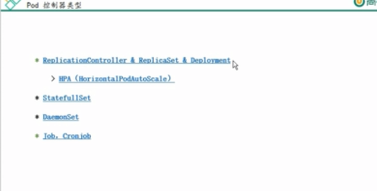
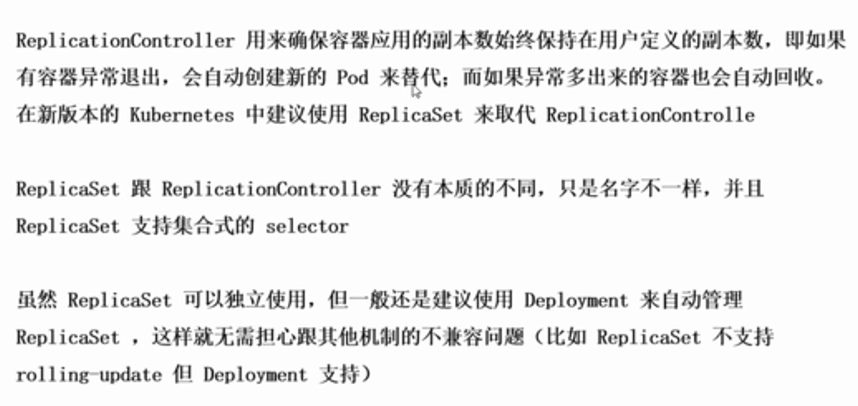

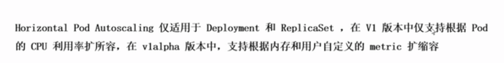

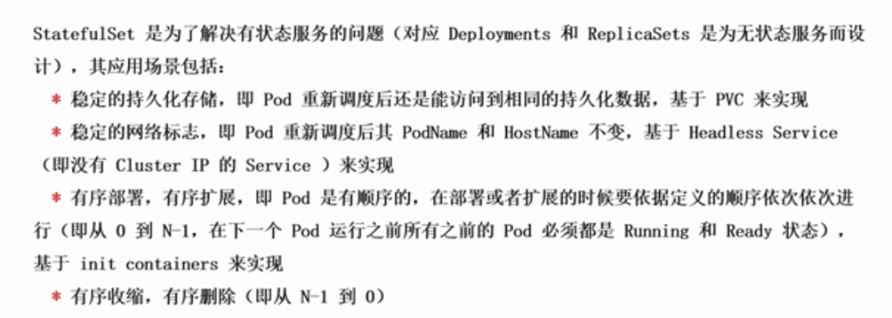

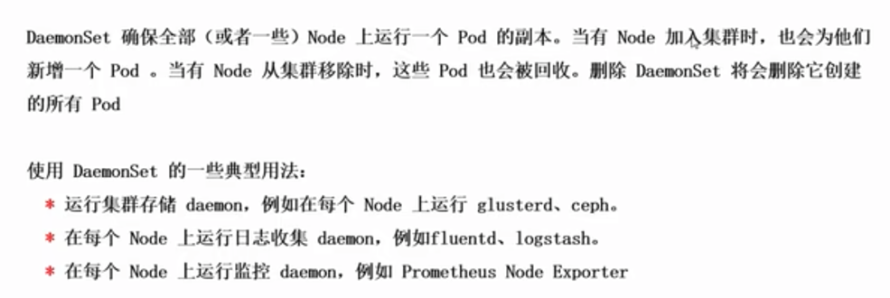
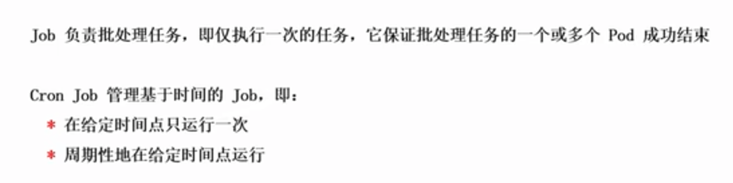

POD网络通讯方式:
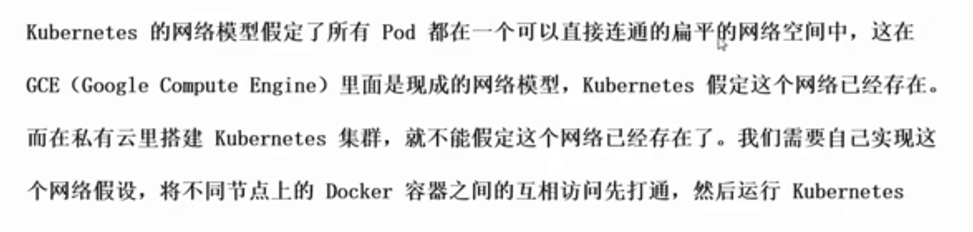
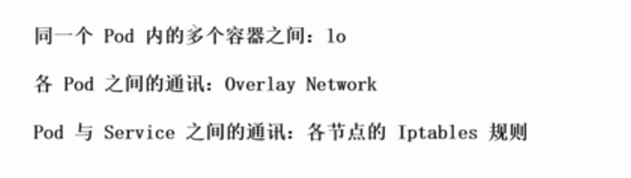
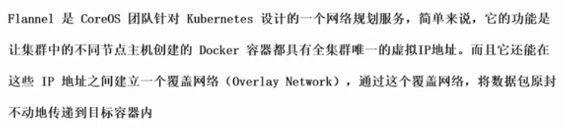
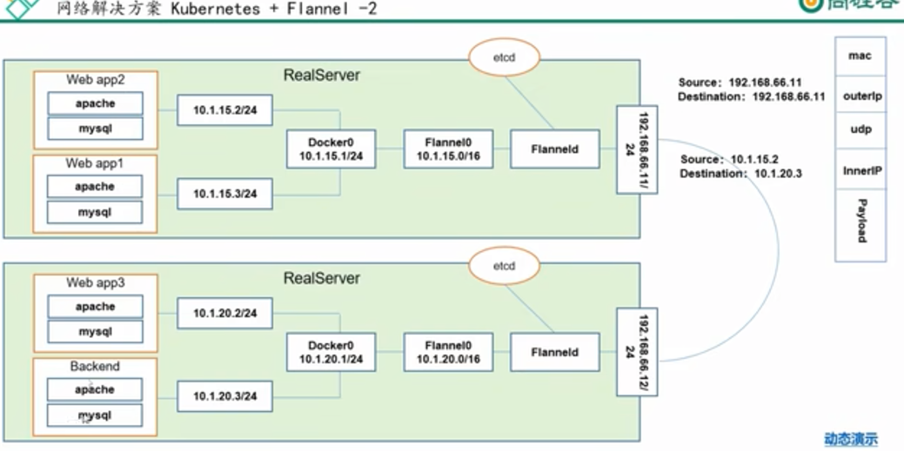
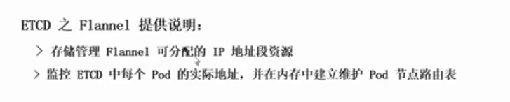 
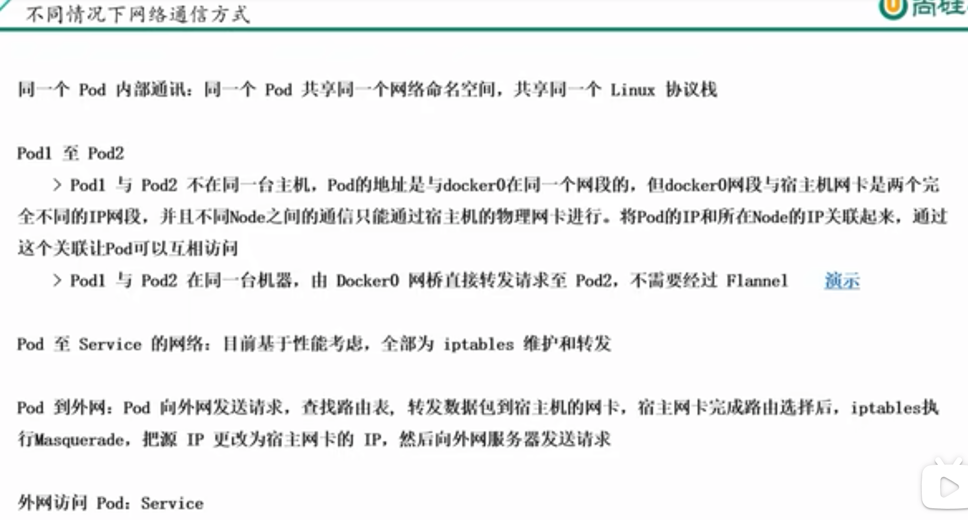
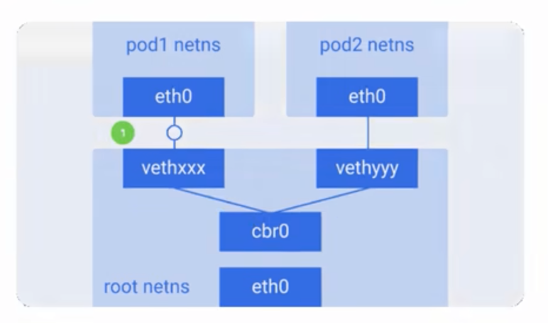
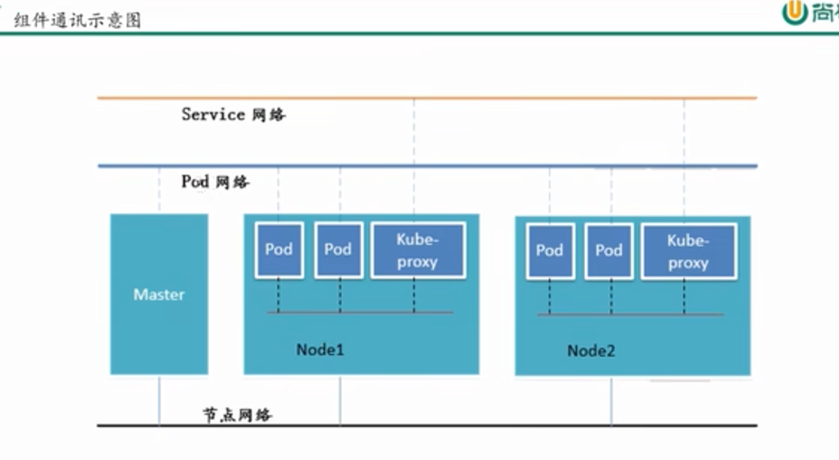