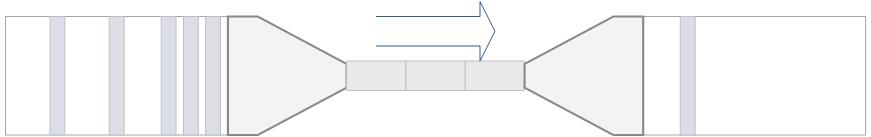

## TX-自适应过载保护
- CPU使用率
- 协程调度耗时
- 睡眠飘逸， time.Sleep(time.Second), 服务负载高时，执行时间一定大于1s
- 最大响应时间

## B站-BBR-滚动窗口思想
https://github.com/go-kratos/aegis/tree/main/ratelimit/bbr
- CPU使用率
- MaxInflight(1s的最大吞吐) = (MaxPass(窗口内最大成功请求数) * MinRt(平均响应延时:ms) * BucketsPerSecond(1s的桶个数) /1000.0) 
tips: math.Floor(MaxInflight + 0.5) 做了四舍五入

## 阿里-sentinel
https://github.com/alibaba/sentinel-golang/wiki/%E7%B3%BB%E7%BB%9F%E8%87%AA%E9%80%82%E5%BA%94%E6%B5%81%E6%8E%A7
- load1 (实时性较较差)
- MaxInflight(1s的最大吞吐) 如上