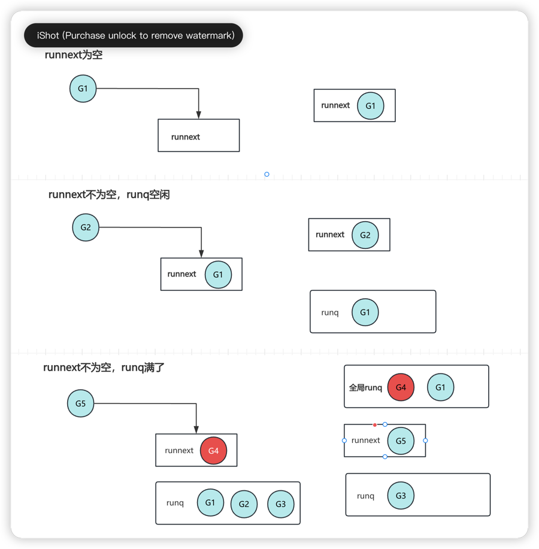
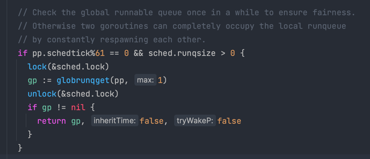
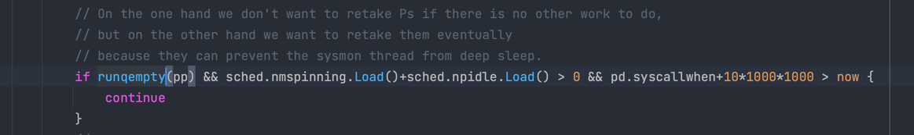

## GMP理解

以Goroutine生命周期来看，GMP更像是生产/消费模型，goroutine被创建之后，调度器会将其放到对应P的"队列"中, 之后被M消费执行的过程。

### 生产细节
在生产阶段，G主要和P交互，P有两个地方存储G, `runnenxt` 和 `runq`。
- P总共可以存储257个G，其中`runnext`1个G，`runq`256个G
- `runnext`存储的是下一个要执行的G，`runq`是一个队列，存储是一批要执行的G；

G和P交互如下图:

`runnext`和`runq`可以整体看成一个FIFO队列，`runnext`指向队尾元素；不过需要注意的是，当队列满的时候，`runnext`还是会被新的G抢占，被强占的G和`runq`的前半部分的G会被合并放到`全局runq`中。

### 消费细节
消费阶段, P优先会消费`runnext`，再依次消费`runq`队列，不过这里有个`调度`细节, 这里说明下:

> 在P都很繁忙的场景下，`全局runq`中的G可能迟迟得不到调度，为了公平起见，调度器会统计`runtime.SchedTick`，每次调度都会++, 当`runtime.SchedTick%61==0`时,会从`全局runq`中获取G来执行(高优先级)。
// /runtime/proc.go，需要加锁

Go Scheduler:
- 复用线程
- 固定线程数 N, 通常 N = CPU核数
- 线程私有runq, 其他线程中窃取G

为什么需要P?
1. 解决GM模型的全局锁问题
2. runq和P绑定，当M在执行阻塞调用休眠时，M和P解绑，P可以去找空闲M继续运行G

Goroutine三种状态:
- Waiting, 阻塞/系统调用中
- Executing, 在M中正在执行
- Runnable, 就绪状态，runq中

<strong>work stealing机制</strong>  
算是负载均衡的消费方式，调度器

G生命周期：
- _GIdle(空闲链表中) -> _GDead(从链表中取出) -> _GRunnable(参数复制、入栈等) -> _GRunning 
- _GSyscall(系统调用) -> _GRunning
- _GWaiting(阻塞) -> GRunnable

Go1.20版本:
每个的M中的schedule()流程: 找runnable的goroutine的流程：
1. 按一定概率(schedtick%61==0)从全局runq获取
2. P的本地runq
3. netpoll
4. 尝试4次随机选择其他P窃取

1)使用 make([]p, nprocs) 初始化全局变量 allp，即 allp = make([]p, nprocs)。 2)循环创建并初始化 nprocs 个 p 结构体对象并依次保存在 allp 切片之中。
3)把 m0 和 allp[0] 绑定在一起，即 m0.p = allp[0]，allp[0].m = m0。
4)把除了 allp[0] 之外的所有 p 放入到全局变量 sched 的 pidle 空闲队列之中。 说明一下，最后一步，代码里是将所有空闲的 P 放入到调度器的全局空闲队列;对于非空闲
的 P(本地队列里有 G 待执行)，则是生成一个 P 链表，返回给 procresize 函数的调用者

Sysmon线程:
和P不需要的关联的m，循环执行，主要指责包含:
- netpoll(fd事件)
- retake (抢占)
- forcegc(定期执行gc)
- scavenge heap (释放内存空间)

retake三要素:
遍历所有P，针对(_Prunning 和 _Psyscall)状态的P, 如果发现满足以下条件就抢占(hand off)

1. 从上一次监控线程观察到 p对应的m处于系统调用/运行时间已经超过10ms
2. p的运行队列里面有等待运行的goroutine
3. 没有“无所事事”的 p; 这就意味着没有“找工 作”的 M，也没有空闲的 P，大家都在“忙”，可能有很多工作要做,因此要抢占当前的 P，让它来承担 一部分工作。

