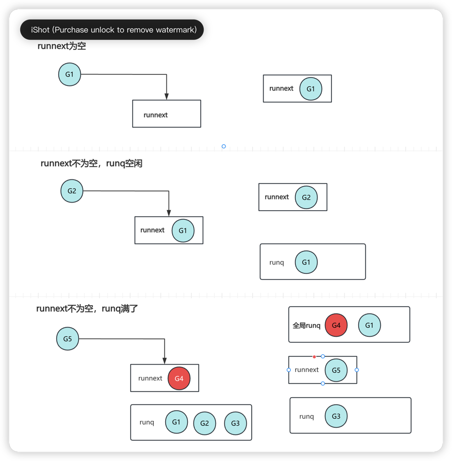

## GMP理解

在我看来GMP是生产/消费模型，goroutine被创建之后，调度器会将其放到一个"队列", 之后由P消费，最终被M执行的过程。

### 生产细节
在生产阶段，G主要和P交互，P有两个地方存储G, `runnenxt` 和 `runq`。
- P总共可以存储257个G，其中`runnext`1个G，`runq`256个G
- `runnext`存储的是下一个要执行的G，`runq`是一个队列，存储是一批要执行的G；

G和P交互如下图:

`runnext`和`runq`可以整体看成一个FIFO队列，`runnext`指向队尾元素；不过需要注意的是，当队列满的时候，`runnext`还是会被新的G抢占，被强占的G和`runq`的前半部分的G会被合并放到`全局runq`中。

### 消费细节
消费阶段，有两种消费模式
1. work stealing 
2. 普通消费

<strong>work stealing机制</strong>  
算是负载均衡的消费方式，当P没有可运行的G时，会主动从其他P(一半G)或者全局runq中窃取G。 

<strong>普通消费模式</strong>  
P优先会消费`runnext`，再依次消费`runq`队列，不过这里有个`调度`细节, 这里说明下:

> 在P都很繁忙的场景下，`全局runq`中的G可能迟迟得不到调度，为了公平起见，调度器会统计`runtime.SchedTick`，每次调度都会++, 当`runtime.SchedTick%61==0`时,会从`全局runq`中获取G来执行。

