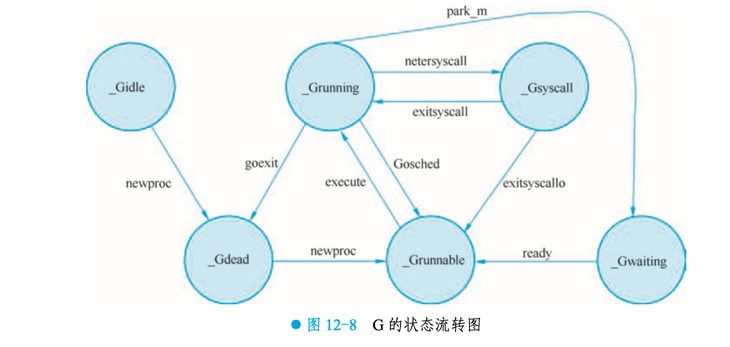
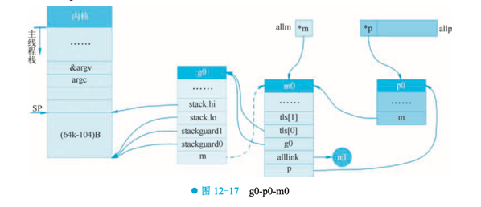

## GMP理解

以Goroutine生命周期来看，GMP更像是生产/消费模型，goroutine被创建之后，调度器会将其放到一个"队列", 之后由P消费，最终被M执行的过程。


### 生产细节
在生产阶段，G主要和P交互，P有两个地方存储G, `runnenxt` 和 `runq`。
- P总共可以存储257个G，其中`runnext`1个G，`runq`256个G
- `runnext`存储的是下一个要执行的G，`runq`是一个队列，存储是一批要执行的G；

G和P交互如下图:


`runnext`和`runq`可以整体看成一个FIFO队列，`runnext`指向队尾元素；不过需要注意的是，当队列满的时候，`runnext`还是会被新的G抢占，被强占的G和`runq`的前半部分的G会被合并放到`全局runq`中。


### 消费细节
go1.20.11版本
消费阶段对应源码`runtime/proc.go`中的`schedule()`的`findRunnable()`方法
1. 保证公平，防止全局`runq`中的goroutine饿死， 按概率(`runtime.SchedTick%61==0`)从全局runq中获取G
2. 从本地`runnext`和`runq`中获取
3. 从全局`runq`中获取
3. 从netpoll中获取G







### steal-work机制
尝试4次, 每次随机选择一个P，尝试从"适合的"P中获取一半G


高效获取一半G:  
从'pp'(受害者P)的`runq`中将其一半g取出写入batch(施害者P的`runq`)，更新`pp`(受害者)的`runq`头指针。
```golang
batchHead := pp.runqtail
batch = &pp.runq

func runqgrab(pp *p // 受害者P, batch *[256]guintptr //施害者P的runq , batchHead uint32 //施害者P的队尾指针, stealRunNextG bool) uint32 {
	for {
		h := atomic.LoadAcq(&pp.runqhead) // load-acquire, synchronize with other consumers
		t := atomic.LoadAcq(&pp.runqtail) // load-acquire, synchronize with the producer
		n := t - h
		n = n - n/2
		
        ....省略非核心...
		//移动后半部分数据
		for i := uint32(0); i < n; i++ {
			g := pp.runq[(h+i)%uint32(len(pp.runq))]
			batch[(batchHead+i)%uint32(len(batch))] = g
		}
		
		if atomic.CasRel(&pp.runqhead, h, h+n) { // cas-release, commits consume
			return n
		}
	}
}

```
执行完`runqgrab`之后，根据返回G的个数，快速定位链表的第一个`G`, 直接返回。


## g0, m0定义


## 调度器的职责


## sysmon的职责
定期垃圾回收


