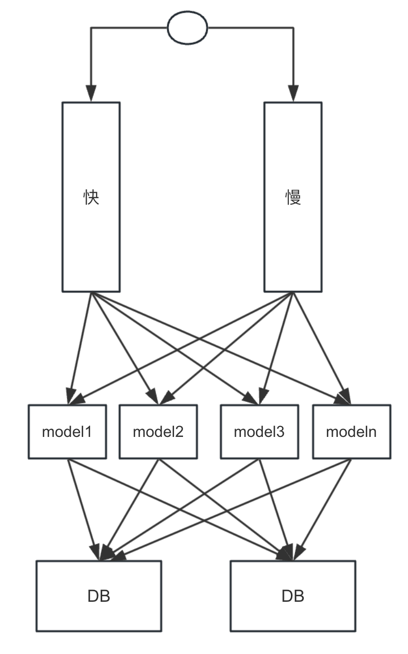
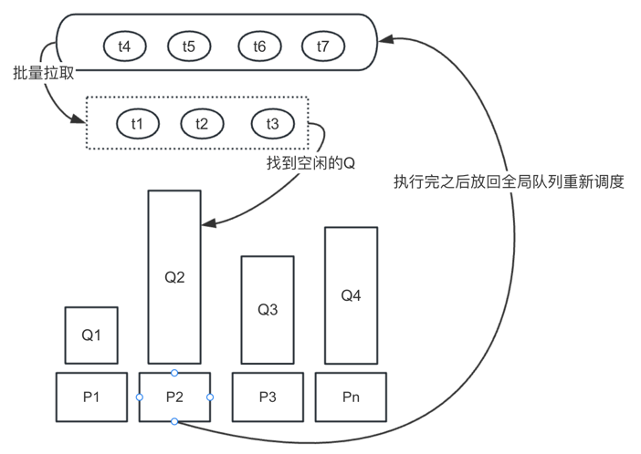
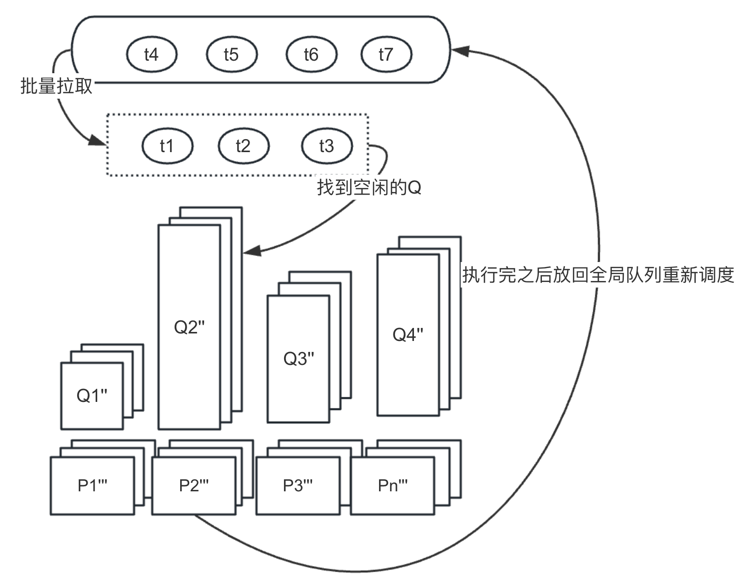

# AI模型并发调度模型

### 业务场景说明
-  视频审核场景中，会对视频进行秒级抽帧，之后会逐张过安审大模型，最终将命中信息落到DB中。
-  目前安审包含8个模型，其中每个模型的吞吐能力不一致

### 业务痛点
- 目前是从队列中逐张消费，每次只能处理一张图片
- waitgroup 并发请求模型，逻辑耗时取决于最慢的AI模型处理 
- 快的模型会有空转，不能继续处理新的请求



### 改进方案
#### 设计思路
-  高性能, 将AI模型抽象具备不同计算能力的Processor, 按每个Processor的处理能力每个Processor配备不同长度的本地队列，起到过载保护的作用
抽象出一个调度模块，从全局队列中批量拉取数据, 并行处理多张图片
-  高可用保障，每次调度之前会先写入记录表，如果有异常，会定期重试修复；不会无限制生产，会根据负载限流。
-  可扩展性，支持Processor维度横向扩展




### 使用方法
```
    #实例化调度器
	scheduler := NewScheduler()

	ctx, cancel := context.WithCancel(context.Background())
	defer cancel()

    # 创建任务
	scheduler.RegHandler(ctx, "face", &models.FaceModel{}, 100)
	
	//开始调度
	go scheduler.Schedule()

	for i := 0; i < 1000; i++ {
		i := i
		for !scheduler.Input(i) {
		}
	}
```